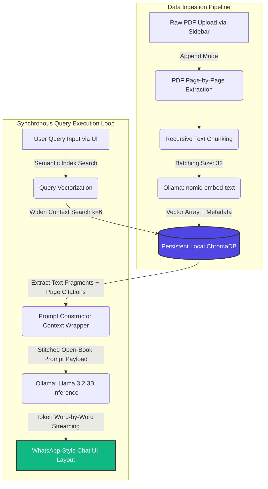

# 📚 Local Doc AI - Private Academic Research Assistant

An enterprise-grade, 100% offline **Retrieval-Augmented Generation (RAG)** application designed to securely index, parse, and query complex technical textbooks and documentation. Powered natively by **Ollama (Llama 3.2)**, **ChromaDB**, and **Streamlit**, this architecture delivers real-time streaming insights with zero data leaving your machine.

Optimized explicitly for **Apple Silicon (M-Series unified memory)** to achieve lightning-fast local inference via hardware-accelerated Metal execution.

---

## 🏗️ Architecture & System Workflow

The following flowchart outlines the five-stage local data ingestion pipeline and synchronous query loop running completely inside your hardware environment:



---

## ✨ Core Features

*   **100% Privacy-First Security:** Zero cloud dependencies, zero external tracker APIs, and absolute data isolation.
*   **Dynamic UI Document Manager:** A clean left-hand sidebar workspace panel featuring single-click multi-file drag-and-drop ingestion.
*   **Intelligent Append-Mode Batching:** Adds new documents into your running library seamlessly without wiping out your existing knowledge indexes.
*   **Widen Context Field (`k=6`):** Deep text-mining depth optimized to prevent conceptual blindness across dense technical chapters.
*   **Real-Time Token Streaming:** High-performance, word-by-word responsive text compilation with a dynamic thinking cursor.
*   **Automated Document Citations:** Prints out the exact source filenames and calculated physical PDF page numbers used to formulate answers.
*   **WhatsApp-Style Layout Formatting:** Clean visual chat alignment separating user actions on the right margin from AI telemetry on the left margin.

---

## 🛠️ Project Workspace Directory Layout

```text
local-rag-app/
├── src/
│   ├── __init__.py
│   ├── config.py           # Centralized hardware model paths & chunk configurations
│   ├── database.py         # Thread-safe ChromaDB batch-insertion & caching engine
│   └── engine.py           # Semantic RAG context parser & payload constructor
├── storage/
│   └── chroma_db/          # Persistent local database storage volumes (Git Ignored)
├── uploaded_pdfs/          # Local staging target folder for raw book uploads
├── app.py                  # Streamlit graphical browser interface core application
├── main.py                 # Alternative Command-Line Interface (CLI) entry point
├── requirements.txt        # Isolated environment packages list snapshot
├── .gitignore              # Pre-configured safety tracking ignore settings
└── ROADMAP.md              # Structural blueprint for future platform scale upgrades
```

---

## ⚙️ Prerequisites & Environment Setup

### 1. Hardware Requirements
*   **Processor:** Apple Silicon M-Series (M1, M2, M3 Max/Pro) or modern x86 GPU.
*   **Memory:** Minimum 8GB Unified RAM (16GB highly recommended for dual 8B parameter models).

### 2. Install and Initialize Ollama
1. Download and install the native desktop server client from [ollama.com](https://ollama.com).
2. Launch the desktop application to register local system environmental commands.
3. Open your terminal and pull the optimized vector and inference weights:
   ```bash
   ollama pull nomic-embed-text
   ollama pull llama3.2
   ```

### 3. Clone and Setup Environment
Navigate into your localized development home folder and initialize the environment:
```bash
# Move into your specialized workspace folder
cd ~/ai-projects/local-rag-app

# Instantiate isolated virtual compiler environment
python3 -m venv .venv

# Activate environmental system configurations
source .venv/bin/activate

# Upgrade pip package installer components
pip install --upgrade pip

# Install production-ready application modules
pip install -r requirements.txt
```

---

## 🚀 Execution & Usage

Once your models have been downloaded via Ollama and your python dependencies are installed, launching the platform dashboard is a two-step process:

1. Activate your virtual wrapper if it isn't running already:
   ```bash
   source .venv/bin/activate
   ```
2. Start up the visual app engine runtime dashboard:
   ```bash
   streamlit run app.py
   ```

Your Mac will immediately spin up a local hosting container and automatically forward your browser to your application endpoint at **`http://localhost:8501`**.

---

## 🧪 Recommended Validation Benchmark Tests

Test your active local RAG pipelines using these strategic evaluation queries:

1. **Core Java Concept Retention:** `What is the difference between a class and an object according to Head First Java?`
2. **Framework Specific Integration:** `What is Dependency Injection (DI) and how does Spring handle it?`
3. **Syntax Rendering Validation:** `Show me a code example from the book on how to declare a standard Spring Boot Entity using JPA annotations.`
4. **Strict Guardrail Security Interrogation:** `How do I configure a database connection in a Python Django application?` *(The model should strictly refuse to answer this out-of-scope question and state that it cannot find it in the documents.)*

---

## 📜 License
This application is distributed under the **MIT License**. All uploaded textbooks and operational data models remain the intellectual property of their original authors.
